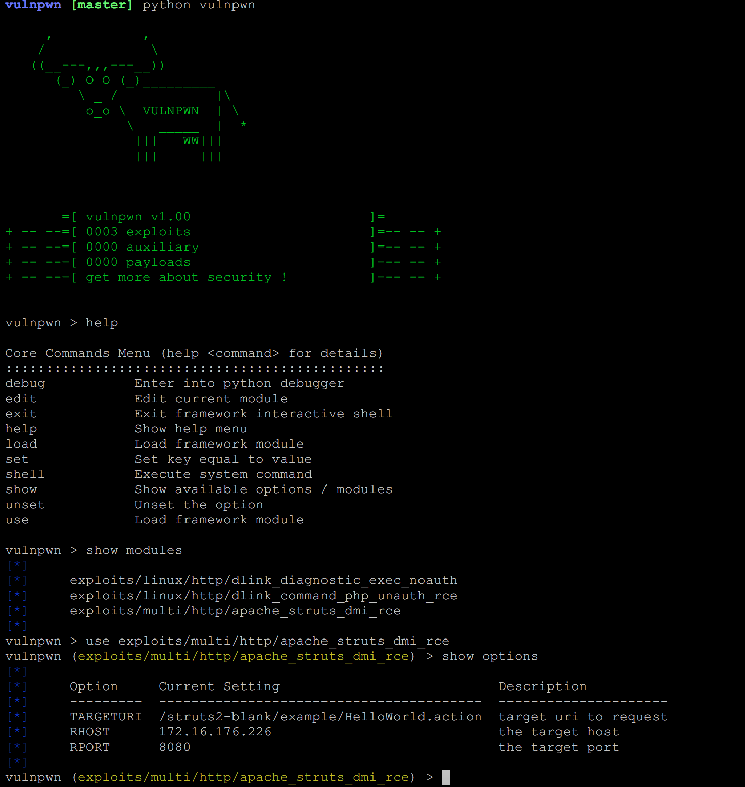
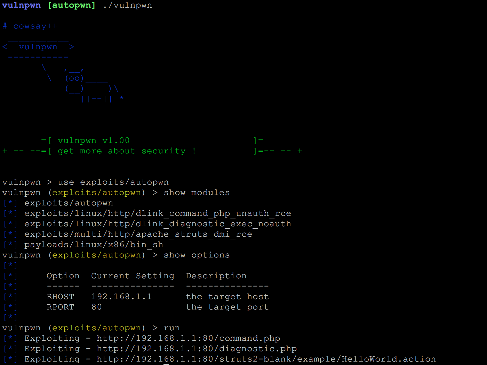

# vulnpwn

  

## Overview

**vulnpwn** is a pythonic framework which is similar to [metasploit-framework](https://github.com/rapid7/metasploit-framework). If you are interested in python pragramming, please join us to create a good open-source project.

## Requirements

- Python 2.7+
- Works on Linux, Windows, Mac OSX, BSD

## Usage

### console

The quick way:

### autopwn

## Features

- Tab Completion
- Module extension design
- Module validation

## Documentation

Documentation is available in [wiki](https://github.com/open-security/vulnpwn/wiki) pages.

## How to Contribute

1. Check for open issues or open a fresh issue to start a discussion around a feature idea or a bug.
2. Fork [the repository](https://github.com/open-security/vulnpwn) on GitHub to start making your changes to the **master** branch (or branch off of it).
3. Write a test which shows that the bug was fixed or that the feature works as expected.
4. Send a pull request and bug the maintainer until it gets merged and published. Make sure to add yourself to [THANKS](./THANKS.md).
